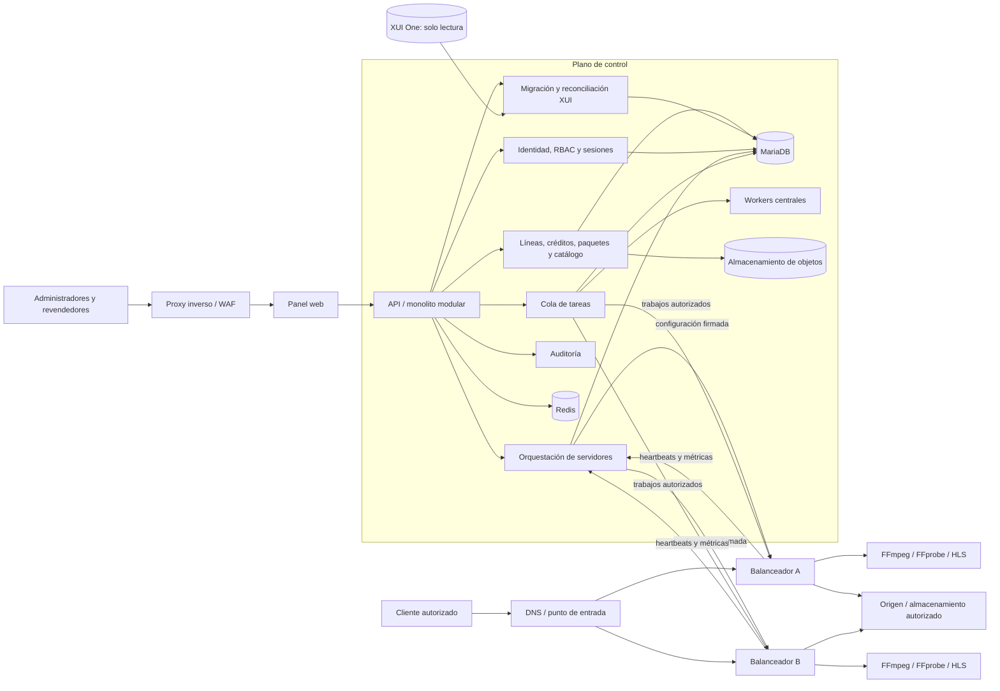
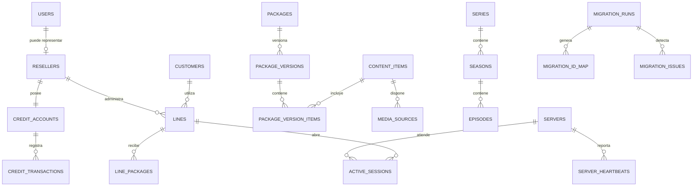

# Plataforma de gestión y distribución de medios licenciados

## 1. Objetivo y alcance

Construir una plataforma propia para administrar usuarios, revendedores, líneas de acceso, paquetes, catálogo de contenido autorizado, servidores de origen y balanceadores. La plataforma deberá permitir migrar desde una instalación XUI One conservando los datos y relaciones relevantes, validar la equivalencia antes del cambio y operar sin depender de XUI One después del corte.

La plataforma se limita a contenido propio o debidamente licenciado. No incluirá adquisición no autorizada de señales, evasión de controles de acceso ni mecanismos destinados a ocultar actividad ilícita.

### 1.1 Objetivos principales

- Sustituir progresivamente el panel existente sin una migración destructiva.
- Conservar identificadores de origen mediante una tabla de correspondencias.
- Administrar superadministradores, administradores, revendedores y clientes finales.
- Gestionar créditos mediante un libro contable auditable.
- Gestionar líneas, fechas de vencimiento, límites de conexiones y dispositivos autorizados.
- Gestionar categorías, canales en vivo autorizados, películas, series, temporadas y episodios.
- Gestionar EPG y asociar programas con canales autorizados.
- Consultar, revisar y aplicar metadatos de TMDB sin sobrescribir cambios manuales.
- Gestionar paquetes y asignarlos a líneas y revendedores.
- Administrar servidores principales, balanceadores y nodos de almacenamiento o entrega.
- Distribuir sesiones usando capacidad, estado y región, evitando sobrecarga.
- Automatizar trabajos autorizados de análisis, segmentación HLS y transcodificación opcional con FFprobe y FFmpeg.
- Mantener auditoría de acciones administrativas y cambios críticos.
- Importar datos de XUI One, reconciliarlos y generar reportes de diferencias.

### 1.2 Fuera de alcance inicial

- Aplicaciones de reproducción para televisores o teléfonos.
- Transcodificación avanzada y DRM propio.
- Facturación fiscal y pasarelas de pago.
- Recomendaciones automáticas basadas en inteligencia artificial.
- Operación multirregión activa-activa.
- Compatibilidad automática con todas las modificaciones no documentadas de XUI One.

### 1.3 Restricciones tecnológicas

- PHP 8.3 o superior con MVC propio, ligero y modular.
- Composer solo para librerías justificadas; PDO para todo acceso SQL.
- MariaDB 10.11 o MySQL 8 como fuente de verdad.
- Redis para caché, sesiones, colas, coordinación y datos efímeros.
- Nginx como proxy inverso y servidor de archivos autorizados.
- FFmpeg y FFprobe para análisis y procesamiento multimedia autorizado.
- Workers administrados mediante Supervisor o systemd.
- Cron o scheduler interno para tareas periódicas.
- HTML5, Tailwind CSS, Alpine.js y HTMX en el frontend.
- JavaScript adicional solo cuando sea necesario.
- Instalación reproducible mediante un único script `.sh`, sin Docker.
- No se utilizarán Laravel, React, Vue, Docker ni Kubernetes.
- El frontend deberá ser moderno, responsive, rápido, accesible y sencillo de mantener.

## 2. Documento de requisitos

### 2.1 Actores

| Actor | Responsabilidades |
|---|---|
| Superadministrador | Configuración global, seguridad, migraciones, servidores y auditoría |
| Administrador | Operación diaria de catálogo, paquetes, líneas y soporte |
| Revendedor | Creación y renovación de líneas dentro de permisos y saldo disponibles |
| Cliente final | Uso de una línea válida dentro de sus límites contratados |
| Servidor principal | Autoridad de configuración, autenticación, catálogo y asignación de nodos |
| Balanceador | Ejecución y entrega de sesiones autorizadas; reporte de salud y capacidad |
| Operador de migración | Importación, mapeo, reconciliación, ensayo y corte desde XUI One |

### 2.2 Requisitos funcionales

#### Identidad y acceso

- RF-001: Autenticación segura para operadores administrativos.
- RF-002: Roles y permisos granulares; denegación por defecto.
- RF-003: Suspensión, bloqueo y cierre de sesiones administrativas.
- RF-004: Segundo factor para cuentas privilegiadas en una fase posterior.
- RF-005: Registro auditable de accesos y acciones sensibles.

#### Revendedores y créditos

- RF-010: Alta, edición, suspensión y límites de revendedores.
- RF-011: Saldo de créditos calculado a partir de transacciones inmutables.
- RF-012: Transferencias idempotentes y transaccionales.
- RF-013: Tarifas y permisos por paquete, duración y tipo de línea.
- RF-014: Imposibilidad de gastar saldo negativo salvo autorización explícita.

#### Líneas y clientes

- RF-020: Crear, renovar, suspender, bloquear y eliminar lógicamente líneas.
- RF-021: Definir inicio, vencimiento, máximo de conexiones y formatos permitidos.
- RF-022: Asociar uno o varios paquetes a una línea.
- RF-023: Registrar sesiones activas y expulsarlas de forma controlada.
- RF-024: Aplicar límites de conexiones de manera atómica entre balanceadores.
- RF-025: Conservar las credenciales originales únicamente cuando sea técnicamente seguro; en caso contrario, rotarlas durante el corte.

#### Catálogo y paquetes

- RF-030: Gestionar categorías de vivo, películas y series.
- RF-031: Gestionar metadatos, imágenes, idioma, clasificación y estado de publicación.
- RF-032: Modelar series, temporadas y episodios sin duplicar metadatos.
- RF-033: Crear paquetes versionados con contenido autorizado.
- RF-034: Publicar cambios de catálogo con invalidación de caché.
- RF-035: Registrar la procedencia y derechos del contenido.

#### EPG y metadatos

- RF-036: Importar EPG desde fuentes autorizadas y configurables.
- RF-037: Normalizar canales, programas, horarios y zonas horarias en UTC.
- RF-038: Asociar manual y automáticamente canales EPG con canales del catálogo.
- RF-039: Consultar TMDB mediante credenciales protegidas, guardar procedencia y conservar ediciones manuales.
- RF-040: Programar actualizaciones incrementales con límites de frecuencia, reintentos y caché.

#### Procesamiento automático

- RF-041: Analizar fuentes autorizadas con FFprobe antes de publicarlas.
- RF-042: Encolar segmentación HLS, generación de artefactos y transcodificación opcional.
- RF-043: Definir perfiles de procesamiento versionados con límites de CPU, memoria y tiempo.
- RF-044: Cancelar, reintentar y auditar trabajos sin duplicar resultados.
- RF-045: Mantener estados y progreso: pendiente, reservado, ejecutando, completado, fallido o cancelado.

#### Infraestructura de entrega

- RF-050: Registrar servidores y balanceadores con identidad criptográfica propia.
- RF-051: Recibir heartbeats autenticados con CPU, memoria, disco, red y sesiones.
- RF-052: Asignar sesiones por salud, capacidad, región y afinidad.
- RF-053: Retirar nodos sin aceptar sesiones nuevas y drenar las existentes.
- RF-054: Marcar automáticamente nodos no disponibles al expirar sus heartbeats.
- RF-055: Usar URLs o tokens de reproducción firmados y de corta duración.
- RF-056: Impedir que las credenciales de un balanceador accedan al panel o a APIs administrativas.
- RF-057: Autorizar a cada balanceador únicamente para heartbeat, configuración asignada, trabajos reservados y validación operativa necesaria.
- RF-058: Controlar conexiones concurrentes de forma coordinada y con expiración automática.

#### APIs y monitorización

- RF-060: Exponer una API central versionada con autenticación, autorización y límites de frecuencia.
- RF-061: Separar rutas administrativas, de revendedores, de clientes y de nodos.
- RF-062: Publicar métricas de salud de servicios, workers, colas, almacenamiento y nodos.
- RF-063: Generar alertas ante nodos fuera de línea, colas atascadas, disco crítico o fallos repetidos.
- RF-064: Usar identificadores de correlación para seguir solicitudes, trabajos y eventos entre componentes.

#### Migración XUI One

- RF-070: Conectarse al origen con privilegios de solo lectura o importar desde un respaldo restaurado.
- RF-071: Inventariar versión, tablas, columnas, conteos y relaciones antes de copiar.
- RF-072: Crear una réplica aislada e inmutable de los datos de origen.
- RF-073: Convertir entidades mediante reglas versionadas y tablas de correspondencia.
- RF-074: Conservar IDs de origen como referencias, sin obligar a reutilizarlos internamente.
- RF-075: Detectar duplicados, referencias huérfanas, valores inválidos y secretos incompatibles.
- RF-076: Comparar conteos y resultados funcionales antes del corte.
- RF-077: Permitir múltiples ensayos sin duplicar datos.
- RF-078: Disponer de ventana de congelación, migración delta y plan de reversión.

### 2.3 Requisitos no funcionales

- RNF-001: MariaDB/MySQL con tablas InnoDB, claves foráneas y migraciones versionadas.
- RNF-002: Operaciones financieras y límites de conexiones deben ser transaccionales.
- RNF-003: Las APIs internas deben ser idempotentes donde puedan repetirse solicitudes.
- RNF-004: Ninguna contraseña o secreto debe almacenarse en texto plano en el sistema nuevo.
- RNF-005: TLS obligatorio entre usuarios, panel y nodos; preferiblemente mTLS entre nodos.
- RNF-006: Logs estructurados sin contraseñas, tokens ni URLs firmadas completas.
- RNF-007: Métricas, alertas y trazas para operaciones críticas.
- RNF-008: Copias de seguridad cifradas y pruebas periódicas de restauración.
- RNF-009: Objetivos iniciales: 99.9 % de disponibilidad del plano de control y recuperación documentada.
- RNF-010: El plano de entrega podrá continuar temporalmente durante una caída breve del panel usando autorizaciones ya emitidas y de duración limitada.
- RNF-011: Todas las fechas internas se almacenarán en UTC.
- RNF-012: El rendimiento se validará con cargas representativas antes de producción; no se fijará capacidad sin medición.
- RNF-013: La instalación limpia en Ubuntu Server 22.04/24.04 se realizará con un único script idempotente y sin Docker.
- RNF-014: Los workers deberán imponer límites de duración, memoria, concurrencia y disco temporal.
- RNF-015: Las APIs usarán versionado, respuestas consistentes y compatibilidad documentada.
- RNF-016: El panel deberá ser responsive y cumplir como mínimo WCAG 2.1 AA en sus flujos principales.

## 3. Arquitectura propuesta

Se propone una arquitectura modular con dos planos separados:

- **Plano de control:** panel web, API administrativa, autenticación, reglas, catálogo, migraciones y base de datos.
- **Plano de entrega:** balanceadores y nodos que validan autorizaciones firmadas, sirven contenido permitido y reportan telemetría.
- **Plano de procesamiento:** workers asignados a nodos autorizados para ejecutar FFprobe, FFmpeg, segmentación HLS y tareas de catálogo.

El servidor principal es la autoridad del sistema, pero no debe transportar todo el tráfico multimedia. Los balanceadores reciben configuración versionada y tokens firmados; así se reduce la carga sobre el principal y se limita el impacto de una indisponibilidad breve.

### 3.1 Decisiones arquitectónicas

- Monolito modular para el plano de control durante las primeras fases.
- API interna explícita entre el principal y los nodos.
- MariaDB/MySQL como fuente de verdad.
- Redis para caché, rate limiting, sesiones efímeras, bloqueos breves y coordinación de conexiones.
- Cola de trabajos para importaciones, reconciliación, metadatos y tareas de mantenimiento.
- Almacenamiento de objetos para imágenes y otros artefactos, evitando guardar archivos grandes en la base.
- Configuración de nodos con versiones y activación atómica.
- Adaptadores de importación separados del dominio nativo.
- Panel renderizado en servidor, con Tailwind CSS, Alpine.js y HTMX; sin SPA obligatoria.
- API de nodos separada de las APIs administrativa y de revendedores.
- Ningún balanceador tendrá credenciales de base de datos ni acceso administrativo general al principal.

### 3.2 Responsabilidades por componente

**Servidor principal:** panel administrativo, panel de revendedores, API central, autenticación, base principal, usuarios, créditos, catálogo, EPG, metadatos, servidores, auditoría, configuración, distribución de tareas y monitorización.

**Servidores balanceadores:** entrega autorizada, proxy permitido, caché, verificación local de tokens, control coordinado de conexiones, FFprobe, FFmpeg, transcodificación opcional, segmentación HLS y reporte de CPU, RAM, disco, red y sesiones. No administran usuarios, créditos, roles ni configuración global.

## 4. Diagrama de componentes



## 5. Flujo entre servidor principal y balanceadores

### 5.1 Registro y confianza

1. El principal genera una invitación de registro de un solo uso.
2. El balanceador genera su clave privada localmente y presenta su identidad.
3. El principal valida la invitación y registra la clave pública o emite un certificado interno.
4. Las comunicaciones posteriores usan TLS y mensajes autenticados.
5. La rotación o revocación de una identidad queda auditada.

### 5.2 Heartbeat y configuración

1. Cada balanceador envía periódicamente salud, capacidad, versión y número de sesiones.
2. El principal verifica identidad, sello temporal y protección contra repetición.
3. El principal calcula el estado del nodo: pendiente, disponible, degradado, drenando o fuera de línea.
4. Si existe una configuración nueva, responde con su versión y ubicación firmada.
5. El balanceador descarga, valida y prepara la configuración.
6. El balanceador activa la versión de manera atómica y confirma el resultado.
7. Si falla, conserva la última versión válida y reporta el error.

Las credenciales utilizadas en este flujo no permiten iniciar sesión en el panel, consultar usuarios, modificar créditos ni acceder directamente a MariaDB o Redis.

### 5.3 Autorización y entrega

1. El cliente solicita acceso al punto público.
2. El principal o un servicio de autorización comprueba línea, paquete, vencimiento y límite.
3. Redis realiza una reserva atómica de conexión con caducidad.
4. El selector elige un balanceador saludable por región, capacidad y afinidad.
5. Se emite un token firmado de corta duración ligado a línea, recurso y nodo.
6. El cliente accede al balanceador seleccionado.
7. El balanceador valida localmente firma, alcance y expiración del token.
8. Durante la sesión renueva el arrendamiento de conexión y registra métricas.
9. Al finalizar, libera la reserva; la expiración corrige cierres no reportados.

### 5.4 Fallos

- Heartbeat vencido: el nodo deja de recibir sesiones nuevas.
- Nodo degradado: reduce su peso progresivamente.
- Caída del principal: los nodos aceptan solamente tokens ya emitidos hasta su expiración.
- Pérdida de Redis: se aplica una política conservadora y se alerta; no se incrementan límites silenciosamente.
- Configuración inválida: el nodo vuelve a la última versión válida.

## 6. Estructura de directorios propuesta

```text
app/
  Core/                 # arranque, configuración, HTTP y contenedor
  Domain/
    Identity/
    Resellers/
    Credits/
    Lines/
    Packages/
    Catalog/
    Epg/
    Metadata/
    Processing/
    Infrastructure/
    Sessions/
    Migration/
    Audit/
  Application/          # casos de uso, comandos, consultas y DTO
  Infrastructure/
    Database/
    Cache/
    Queue/
    Storage/
    Security/
    XuiOne/
  Http/
    Controllers/
    Middleware/
    Requests/
  Console/
    Commands/
  Workers/
    Jobs/
    Handlers/
config/
database/
  migrations/
  seeders/
docs/
public/
resources/
  views/
  assets/
routes/
  web.php
  api-admin.php
  api-reseller.php
  api-node.php
scripts/
  install.sh
  scheduler.php
storage/
  cache/
  logs/
tests/
  Unit/
  Integration/
  Contract/
  Migration/
  Security/
```

Regla de dependencia: `Domain` no conoce HTTP, PDO, Redis ni XUI One. Los adaptadores externos dependen del dominio, no al contrario.

## 7. Esquema preliminar de base de datos

### 7.1 Identidad y permisos

- `users`: operadores administrativos.
- `roles`, `permissions`, `user_roles`, `role_permissions`.
- `admin_sessions`: sesiones, dispositivo y revocación.
- `mfa_credentials`: credenciales de segundo factor cifradas.

### 7.2 Revendedores y créditos

- `resellers`: propietario, estado, límites y jerarquía opcional.
- `reseller_credit_accounts`: cuenta y saldo materializado.
- `reseller_credit_transactions`: libro contable inmutable e idempotente.
- `reseller_package_prices`: precios y permisos específicos.

### 7.3 Clientes, líneas y sesiones

- `customers`: perfil opcional del cliente final.
- `lines`: credencial, estado, inicio, vencimiento y máximo de conexiones.
- `line_packages`: relación versionada entre líneas y paquetes.
- `line_output_formats`: formatos permitidos.
- `line_devices`: dispositivos autorizados cuando aplique.
- `active_sessions`: arrendamientos activos, nodo, recurso y última actividad.

### 7.4 Catálogo

- `categories`: jerarquía y tipo.
- `content_items`: datos comunes de cualquier contenido.
- `live_channels`: atributos exclusivos de vivo.
- `movies`: atributos exclusivos de películas.
- `series`, `seasons`, `episodes`.
- `media_sources`: origen autorizado, prioridad, protocolo y estado.
- `content_assets`: imágenes y archivos auxiliares.
- `content_rights`: procedencia, territorio y vigencia de derechos.
- `packages`, `package_versions`, `package_version_items`.

### 7.5 EPG, TMDB y procesamiento

- `epg_sources`: fuente, zona horaria, frecuencia y estado.
- `epg_channels`: identificadores externos normalizados.
- `epg_channel_mappings`: correspondencia con canales internos.
- `epg_programmes`: programa, inicio, fin, descripción y metadatos.
- `metadata_providers`: configuración no secreta y estado de proveedores.
- `metadata_matches`: candidato, puntuación, decisión y procedencia.
- `processing_profiles`: parámetros versionados y límites permitidos.
- `processing_jobs`: tipo, recurso, nodo, estado, intento y progreso.
- `processing_job_events`: historial inmutable del trabajo.
- `processing_artifacts`: salida, checksum, tamaño y ubicación.

### 7.6 Infraestructura

- `servers`: identidad lógica y región.
- `server_credentials`: claves públicas, certificados y revocación.
- `server_heartbeats`: métricas históricas.
- `server_state`: último estado materializado.
- `configuration_versions`: configuraciones firmadas e inmutables.
- `server_configuration_assignments`: versión activa y confirmada por nodo.

### 7.7 Migración y auditoría

- `migration_runs`: origen, versión, estado, fase y tiempos.
- `migration_source_tables`: estructura, conteos y checksums.
- `migration_id_map`: entidad, ID origen e ID destino.
- `migration_issues`: conflicto, severidad, resolución y evidencia.
- `migration_metrics`: conteos esperados, convertidos, omitidos y fallidos.
- `audit_logs`: actor, acción, entidad, IP, correlación y metadatos seguros.

### 7.8 Relaciones esenciales



El diseño definitivo dependerá del inventario real de XUI One y de las consultas de mayor frecuencia. No se copiarán contraseñas o secretos incompatibles como si fueran válidos en el sistema nuevo.

## 8. Lista ordenada de módulos

1. Fundamentos, configuración, migraciones y observabilidad.
2. Identidad, sesiones administrativas, RBAC y auditoría.
3. Importación, inventario y reconciliación de XUI One.
4. Revendedores y libro contable de créditos.
5. Clientes, líneas, renovaciones y paquetes.
6. Catálogo común, categorías y derechos de contenido.
7. Películas, series, temporadas y episodios.
8. EPG y correspondencia de canales.
9. TMDB y reconciliación de metadatos.
10. Servidores, identidad de nodos y heartbeats.
11. Cola, workers, FFprobe, FFmpeg y perfiles de procesamiento.
12. Configuración versionada y distribución a balanceadores.
13. Autorización, sesiones activas y límite de conexiones.
14. Selección de balanceador, drenaje y recuperación de fallos.
15. Operación, logs, APIs, reportes, respaldo, restauración y alertas.
16. Ensayos de migración, delta final, corte y retirada de XUI One.

## 9. Riesgos técnicos y de seguridad

| Riesgo | Impacto | Mitigación principal |
|---|---|---|
| Variaciones del esquema XUI One | Datos incompletos o reglas erróneas | Inventario previo, adaptadores versionados y muestras anonimizadas |
| Contraseñas o secretos heredados | Compromiso de cuentas | No copiarlos en claro; rotación o reemisión controlada |
| Migración con origen activo | Conteos inconsistentes | Snapshot consistente, ensayos y delta durante congelación |
| IDs y referencias huérfanas | Entidades desconectadas | Tabla de correspondencias y reporte bloqueante |
| Doble gasto de créditos | Pérdida financiera | Libro inmutable, transacciones e idempotencia |
| Carrera en límites de conexión | Uso por encima del contrato | Reservas atómicas y arrendamientos con expiración |
| Balanceador comprometido | Acceso indebido o filtración | Identidad por nodo, mínimo privilegio y revocación rápida |
| Ejecución insegura de FFmpeg | Lectura de archivos, SSRF o agotamiento de recursos | Argumentos estructurados, protocolos permitidos, sandbox de proceso y límites del sistema |
| Archivo multimedia malicioso | Fallo o explotación de decodificador | Versiones mantenidas, usuario aislado, límites y análisis fuera del proceso web |
| Saturación de disco por HLS/caché | Interrupción del nodo | Cuotas, reservas, limpieza y alertas por umbral |
| Datos EPG o TMDB no confiables | XSS, metadatos erróneos o abuso de API | Sanitización, revisión, caché, rate limiting y registro de procedencia |
| Repetición de heartbeats o comandos | Estado falso | Nonce, sello temporal, firma y ventana de aceptación |
| SSRF mediante URLs de origen | Acceso a red interna | Listas permitidas, resolución segura y segmentación de red |
| Inyección SQL o comandos | Control del sistema | Consultas preparadas, validación y procesos sin shell |
| Exposición de tokens en logs | Reutilización de acceso | Redacción de logs y tokens breves ligados a alcance |
| Datos personales en auditoría | Incumplimiento y exposición | Minimización, retención y control de acceso |
| Caída del principal | Nuevas sesiones interrumpidas | Tokens verificables localmente y alta disponibilidad posterior |
| Redis indisponible | Límites inconsistentes | Política conservadora, monitoreo y configuración HA |
| Configuración defectuosa masiva | Caída de entrega | Versionado, canarios, activación atómica y rollback |
| Eliminación accidental | Pérdida irreversible | Borrado lógico, backups cifrados y restauraciones probadas |
| Dependencia de un único servidor | Punto único de fallo | Separar planos y añadir redundancia según métricas |
| Contenido sin derechos verificables | Riesgo legal | Registro de derechos y bloqueo al vencer la autorización |

## 10. Plan de implementación y criterios de terminación

### Fase 0 — Descubrimiento y línea base

**Trabajo:** inventario anonimizado de XUI One, volumen, versión, extensiones, topología, formatos, políticas de líneas y requisitos operativos.

**Terminada cuando:**

- Existe un diccionario del esquema de origen y un conteo firmado por tabla.
- Todas las entidades se clasifican como migrar, transformar, archivar u omitir.
- Se documentan RPO, RTO, ventana de corte y responsables.
- Las ambigüedades críticas tienen una decisión aprobada.

### Fase 1 — Fundamentos seguros

**Trabajo:** configuración, migraciones versionadas, secretos, logs, métricas, manejo de errores, CI y entornos.

**Terminada cuando:**

- Una instalación limpia y una actualización repetida producen el mismo esquema.
- Secretos no aparecen en repositorio ni logs.
- Pruebas automáticas, análisis estático y respaldo/restauración pasan.
- Existe un entorno de ensayo aislado.

### Fase 2 — Identidad, RBAC y auditoría

**Trabajo:** usuarios administrativos, sesiones, roles, permisos y eventos auditables.

**Terminada cuando:**

- Cada endpoint administrativo exige autenticación y permiso explícito.
- CSRF, fijación de sesión, rate limiting y revocación están probados.
- Las acciones críticas generan auditoría correlacionada.
- Pruebas negativas confirman denegación por defecto.

### Fase 3 — Réplica e importación XUI One

**Trabajo:** conexión de solo lectura, réplica aislada, adaptadores, mapeo de IDs y reconciliación.

**Terminada cuando:**

- Tres ejecuciones sobre el mismo snapshot son idempotentes.
- Conteos de origen y réplica coinciden para todas las tablas incluidas.
- Cada fila transformada posee trazabilidad al ID de origen.
- No quedan errores de severidad bloqueante sin resolución.
- El reporte enumera diferencias intencionales y no intencionales.

### Fase 4 — Revendedores, créditos, líneas y paquetes

**Trabajo:** libro de créditos, clientes, líneas, renovaciones, límites y paquetes versionados.

**Terminada cuando:**

- El saldo coincide con la suma del libro contable.
- Reintentar una operación no duplica cargos ni líneas.
- Casos de suspensión, vencimiento y renovación pasan pruebas de integración.
- Una muestra y el total migrado concilian con XUI One según reglas aprobadas.

### Fase 5 — Catálogo y fuentes autorizadas

**Trabajo:** categorías, vivo, películas, series, episodios, metadatos, derechos y fuentes.

**Terminada cuando:**

- Todos los elementos publicables tienen categoría, fuente válida y estado definido.
- Series, temporadas y episodios no contienen relaciones huérfanas.
- El vencimiento de derechos impide nuevas autorizaciones.
- Los conteos por tipo y paquete concilian con el reporte de migración.

### Fase 5B — EPG y TMDB

**Trabajo:** fuentes EPG, normalización horaria, correspondencia de canales, consultas TMDB, revisión y aplicación de metadatos.

**Terminada cuando:**

- Importar dos veces la misma fuente no duplica programas.
- Horarios y cambios de zona se almacenan y presentan correctamente.
- Las correspondencias automáticas requieren umbral y permiten revisión manual.
- TMDB respeta límites, caché y procedencia, sin sobrescribir ediciones manuales.

### Fase 6 — Principal, balanceadores y configuración

**Trabajo:** enrolamiento de nodos, certificados, heartbeats, métricas, configuración firmada, canarios y rollback.

**Terminada cuando:**

- Un nodo no registrado no puede reportar ni recibir configuración.
- La pérdida de heartbeats retira el nodo dentro del tiempo definido.
- Una configuración inválida no sustituye la última válida.
- Rotación y revocación de credenciales funcionan sin acceso manual a la base.
- El despliegue canario y el rollback están ensayados.
- Las credenciales de nodo son rechazadas por todas las rutas administrativas y de revendedores.

### Fase 6B — Workers y procesamiento multimedia

**Trabajo:** cola Redis, workers supervisados, FFprobe, FFmpeg, HLS, perfiles y artefactos.

**Terminada cuando:**

- Los trabajos son idempotentes y recuperables tras reiniciar un worker.
- Argumentos no autorizados, protocolos externos y rutas fuera del espacio asignado son rechazados.
- CPU, memoria, duración, concurrencia y disco están limitados y monitorizados.
- Cancelación, reintento, progreso y limpieza de artefactos han sido probados.

### Fase 7 — Autorización, sesiones y balanceo

**Trabajo:** tokens breves, reservas de conexiones, selector de nodo, afinidad, drenaje y fallos.

**Terminada cuando:**

- Líneas vencidas, suspendidas o sin paquete son rechazadas.
- Pruebas concurrentes no superan el máximo de conexiones.
- Tokens alterados, vencidos o destinados a otro recurso son rechazados.
- Retirar un nodo evita sesiones nuevas sin cortar las existentes fuera de política.
- La prueba de carga cumple los objetivos acordados con margen documentado.

### Fase 8 — Ensayo, corte y estabilización

**Trabajo:** migraciones completas repetidas, delta final, congelación, cambio de tráfico, observación y reversión.

**Terminada cuando:**

- Dos ensayos completos cumplen tiempo, conteos y criterios funcionales.
- Existe respaldo verificado inmediatamente anterior al corte.
- El plan de reversión fue ensayado y tiene un límite de decisión claro.
- Métricas, errores y soporte permanecen dentro de umbrales durante la estabilización.
- Los responsables aprueban la conciliación final antes de retirar XUI One.

## 11. Condiciones globales de aceptación

La plataforma se considerará lista para sustituir XUI One solamente cuando:

- No existan defectos críticos o de seguridad abiertos.
- Todas las entidades migradas sean trazables a su origen.
- Créditos, líneas, paquetes y catálogo estén conciliados.
- Los límites de conexiones hayan superado pruebas concurrentes.
- Se hayan probado respaldo, restauración, revocación, drenaje y rollback.
- La operación tenga paneles de salud, alertas y procedimientos documentados.
- El propietario confirme que todo contenido gestionado está autorizado.
- La instalación limpia mediante un único `.sh` haya sido repetida satisfactoriamente en las versiones de Ubuntu soportadas.
